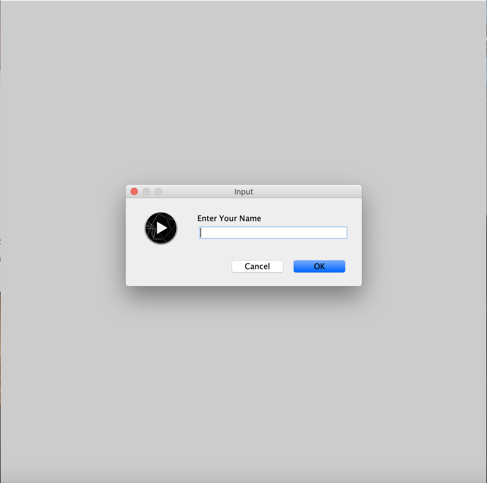
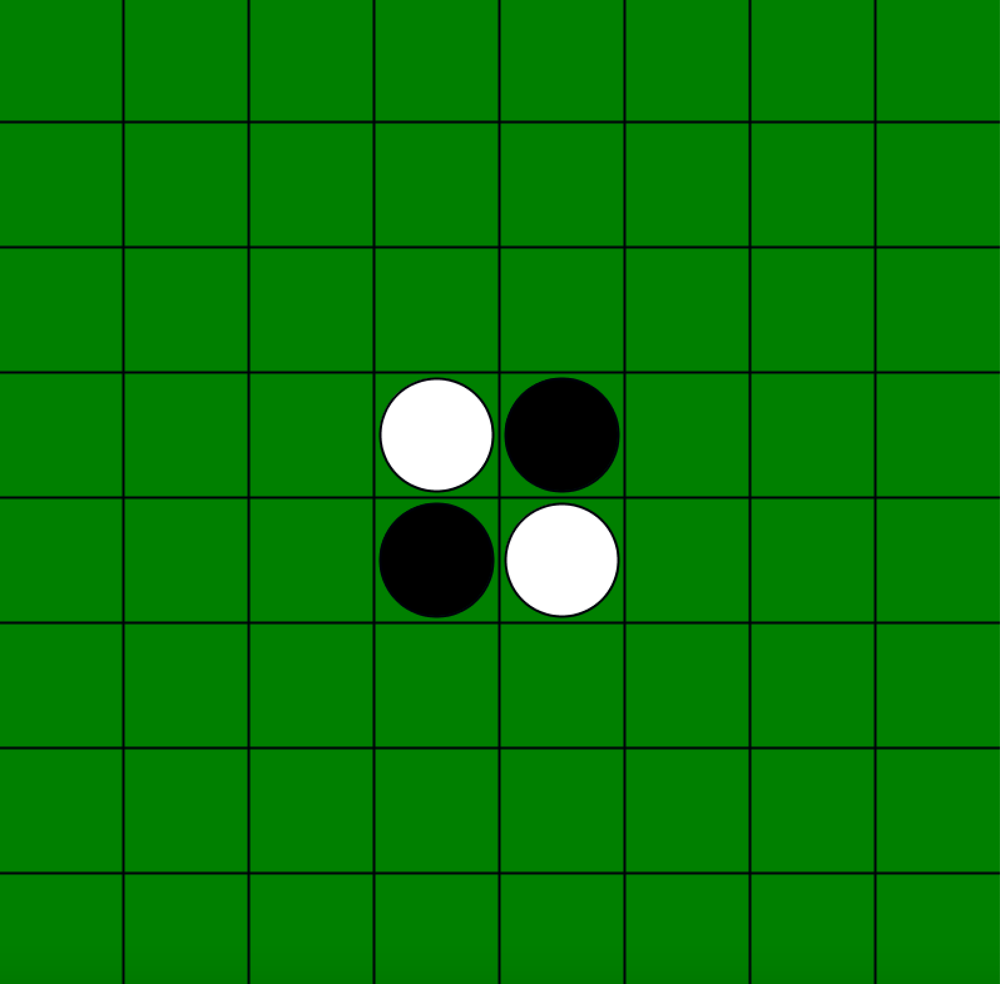
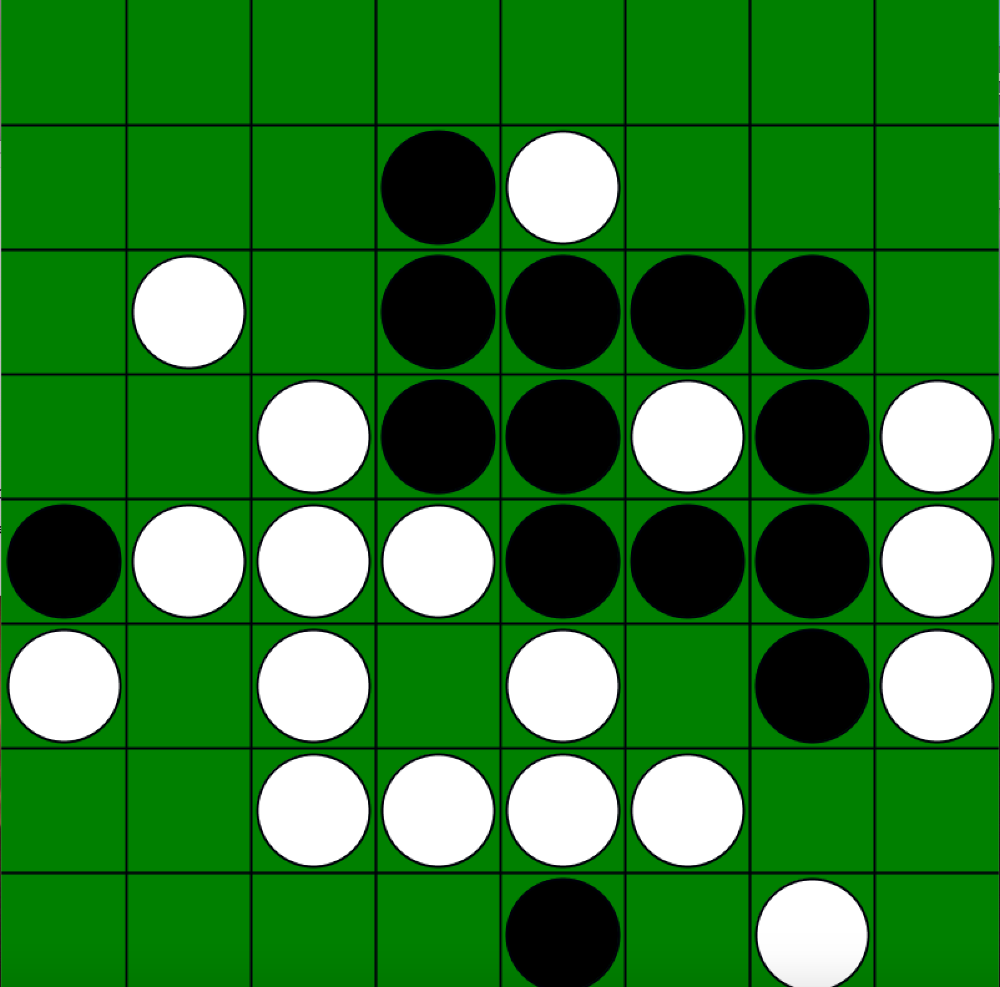
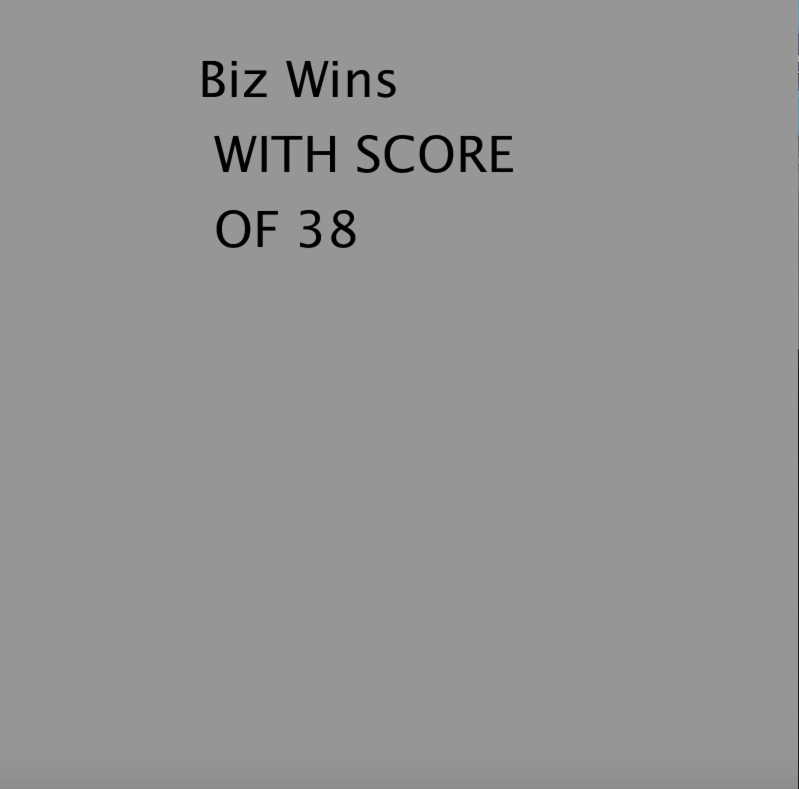

# Othello

I designed and developed [Othello](https://en.wikipedia.org/wiki/Reversi) (aka Reversi) in python using processing library.  

The home screen for the game. You have to input your name before the game starts.
  

This is what the srarting board looks like. You will be the black disks and the computer is the white disks.
  

This is what the board will look like after the human player and computer have had serveral turns to place their disks on the board.
  

Once all of the positions on the board have a disk or there are not any more moves availabe, the winner of the game is announced and the number of disks they have. 
  

